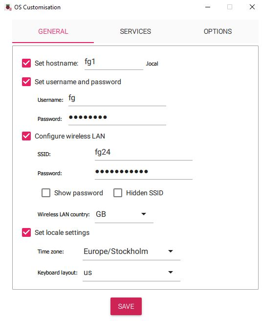

<h1>iapg (interactive photo gallery)</h1>
<h3>A system for interactive display of pictures - on multiple screens/projectors - controlled by tablets</h3>
<h2>Purpose</h2>
Suppose one or a few photography clubs will have an interactive picture exhibition with the following features:
<ul>
  <li>Pictures from the members should be displayed on screens/projectors.</li>
  <li>It should be possible to display a picture simultaneously on multiple screens/projectors.</li>
  <li>The viewing should be controlled by thumbnails on tablets.</li>
  <li>When a thumbnail is clicked the corresponding picture should be displayed on the associated screens/projectors.</li>
  <li>When there has not been a thumbnail click for a while, a slide-show should run.</li>
  <li>It should be possible to run the exhibition in many rooms by using multiple tablets, each with its own set of screens/projectors.</li>
  <li>Many clubs should have the possibility to take part in the exhibition, but they should be independent of each other.</li>
  <li>To be fair to the photographers, all should have equal chance where their thumbnails are placed/ordered on a tablet.</li>
  <li>
    <em>"club" should be used in a broad sense. It could be just pictures from a specific theme like street photography, birds, cars, etc. (or a collection for a slide show)</em>
  </li>
  <li>
    <strong>If you just want simple slideshows you do not need tablets at all.
The system will automatically run slideshows on all screens that have "connected" to the various clubs.</strong>
  </li>
</ul>
<h3>Environment</h3>
<h3>This system requires:</h3>
<ul>
  <li>A LAN.</li>
  <li>A tablet. Its browser will show thumbnails for the viewers to click on.</li>
  <li>A browser (on any computer) or a dedicated "kiosk" with a screen/projector. It will retrieve a tablet (browser) clicked picture from a picture server and display it. </li>
  <li>A picture server. It will host the pictures and respond to requests from the tablets and the kiosks.</li>
  <li>A laptop to maintain the system and view its status.</li>
  <li>Pictures in jpeg format (a picture size of 2 MB should be enough). Thumbnails are automatically created by the system.  </li>
</ul>

<h3>For a trial or a demo the system can be set up as follows</h3>
<ul>
  <li>A LAN</li>
  <li>The tablet could be a browser window on a laptop.</li>
  <li>The "kiosk" could be another browser window on a laptop. The window is thus the "screen"</li>
  <li>The picture server could run in any Debian computer, for example a Raspberry Pi or in a Virtual Box.</li>
</ul>
<h3>This kit includes a ready-to-run demo-gallery :</h3>
<ul>
  <li>HW requirements as in the trial above.</li>
  <li>For the sake of simplicity the picture server is assumed to have the IP address 192.168.0.250. </li>
  <li>When the actions in the SW Installation chapter are done you can run the demo. See the chapter "To run the pre-installed demo-gallery" </li>
</ul>

<h3>The environment in a gallery</h3>
 

<h3>From the demo-gallery</h3>
<h3>The tablet with the thumbnails</h3>

<h3>The display screen/projector on the kiosk</h3>

<h2>The default setup</h2>
<ul>
  <li>After the SW is installed the system is independent of Internet access. </li>
  <li>The system needs support from a router with at least one LAN port, WiFi and DHCP.</li>
  <li>For simplicity the picture server should be connected via an ethernet cable to the router.</li>
  <li>In a show room it is more convenient to use WiFi in the kiosks but with ethernet cables it is less to configure.</li>
  <li>Kiosks and tablets are "associated" in groups. In a group the same picture will be shown on all screens when a thumbnail is clicked.</li>
 </ul>
<h4>The "gallery" was tried out with the following HW</h4>
<ul>
  <li>A tp-link Archer AX12 on a LAN without internet. </li>
  <li>Raspberry Pi4 and Pi5 with 64-bit raspian as picture server and kiosk. </li>
  <li>Browsers and tablets.</li>
</ul>
<h4>The "server room" in the "gallery"</h4>
 

<h4>Principles of operation</h4>

Both the picture server and a dedicated kiosk are designed to run headless, without monitor, keyboard and mouse.

You can though use the desktop on the picture server (if the peripherals are connected.)

If you use a browser on an ordinary computer as a kiosk the desktop is there as well.

A <strong>dedicated</strong> kiosk can only run headless because its desktop is bound to the screen/projector.

An installed system does not need internet access in the gallery.
But the clocks on the servers will not be accurate without Internet time synchronisation . This will not disturb the showings.

<h4>When the picture server and dedicated kiosk(s) are booted a supervisor program in each of them will be started.</h4>
<ul>
<li>It will look for proper configuration files. If a configuration file is missing or bad it will alarm and wait until the file is proper.
When the configuration files look proper the actual server or kiosk will be started.</li> 
<li>It will immediately detect a configuration change or when pictures have been added/deleted etc. It will validate the changes and restart the related server programs in order for them to use the new configuration.</li>
</ul>

With a (monitoring) browser you can view the configuration files, the uploaded member pictures, the status and get notifies on errors. 
The browser will continuously show system status and configuration errors (as long as the LAN is up).

Computers that rely on WiFi are much more prone to network failures than those with ethernet cable connections. 
The "Network problem" section in Miscellaneous describes the method used to try to keep WiFi connected kiosks "up".

The configuration files and the pictures are supposed to be updated/uploaded with FileZilla.

<h2>SW Installation</h2>
<h3>Installation on both picture server and kiosks</h3>
Prepare a system image (micro-SD or USB stick): 
<ol>
<li>
Use "Raspberry Pi Imager" to create a bootable image for the Pi. 
</li>
 
<li>
In "EDIT SETTINGS" add the user "fg" and configure WiFi with the SSID that will be used in the router in the gallery.  
<strong>Be aware</strong> that "EDIT SETTINGS" will not keep the passwords you have once "SAVE". 
If you go back to "EDIT SETTINGS" and if the passwords fields are filled with **************** the passwords are gone. 
 

<strong>If it looks like this, the "wrong" passwords will be saved on the image. A kiosk will thus not startup because it can't find the network/router.</strong> 

<strong>If it looks like this, the passwords you have entered will be saved on the image.</strong> 

</li>
</ol>
<ol>

<h4>Boot the Raspberry Pi and do the installation:</h4>
<li>
Enable SSH remote terminal access. FileZilla needs it. You can then also login remotely via ssh.
<pre>
sudo raspi-config
</pre>
Select "3 Interface Options" -&gt; "I1 SSH Enable/disable remote command line access using SSH" -&gt; "Would ... Yes"
  
</li>
<li>
The servers use Node.js JavaScript runtime environment and its package manager. 
<pre>
sudo apt-get install node.js
sudo apt-get install npm
</pre>
</li>
<li>Install the iapg kit: 
You should be in <code>/home/fg</code> as soon as the system has booted.  If not: reboot and login as "fg".  
 
To get the kit, browse to: 
<a href="https://github.com/pg-andersson/iapg">https://github.com/pg-andersson/iapg</a> and click on "&lt;&gt;Code" and then "Download ZIP" 
Github will create <code>iapg-main.zip</code> that will be copied to Downloads.
  
</li>
<li>When you unzip iapg-main.zip the directory <code>/home/fg/iapg-main</code> will be created and the files copied to it. 
Make sure you are in <code>/home/fg</code> and run: 
<code>unzip Downloads/iapg-main.zip</code> (<em><strong>You must be in "/home/fg" and the user must be "fg" when you unzip</strong></em>).
  
</li>
<li>
Node.js dependencies must be installed now. 
Go to the just created <code>/home/fg/iapg-main</code> and run: 
<code>npm install</code><em><strong>(You must be in "/home/fg/iapg-main" and the user must be "fg"</strong></em>). 
<code>npm install sharp</code> (it creates thumbnails). 
<code>npm install better-sqlite3</code> (thumbnails are cached here).

</li>
</ol>
<h4>Specific to the picture server</h4>
<ol>
<li>
<strong>Important. The picture server needs a static IP address.</strong>  
The router will give the server a static IP address if you define a static lease for the server (actually its MAC) in the gallery router (DHCP). 
Run this command to get the MAC: 
<pre>
ip address    <em>The output will be like this: </em>
2: eth0: ...
    link/ether e4:5f:01:a9:4c:ed ...   <em>This is the MAC you later on shall add in the static lease in the gallery router</em>
    inet .....
</pre>
</li>
<li>
The supervisor shall be started by systemd at boot time.
<pre>
sudo mv /home/fg/iapg-main/iapg_init_server.service /etc/systemd/system/
sudo systemctl enable iapg_init_server.service
</pre>
</li>
<em><strong>The system image is now ready to be used as a picture server in a gallery now.</strong></em>
</ol>
<h4>Specific if you use dedicated kiosk(s)</h4>
<ol>
<li>
The kiosk and the supervisor shall be started by systemd at boot time.
<pre>
sudo mv /home/fg/iapg-main/iapg_init_kiosk.service /etc/systemd/system/
sudo systemctl enable iapg_init_kiosk.service
</pre>
</li>
<li>
systemd shall start the program that will reboot the kiosk on network failures.
<pre>
sudo mv /home/fg/iapg-main/iapg_kiosk_rebooter.service /etc/systemd/system/
sudo systemctl enable iapg_kiosk_rebooter.service
</pre>
</li>
<li>
There is only one parameter file in a kiosk. To update it in the gallery, via FileZilla, you must know the IP of the kiosk. 
Once the kiosk is up: 
<ul>
<li>The status monitor will show the IP of active kiosks.</li>
 
<li>If show_kiosk_ip_as_footer=1 (the default is 0 <em>off</em>) in <code>/home/fg/iapg-main/etc/iapg_server.conf</code> in the picture server,  
the IP, port and club-id for a kiosk will be shown in a footer on the kiosk displays. 
This annoys and even spoils the experience of the showings and <strong>must only be used when the kiosks are tested</strong> in the gallery.
</li>
</ul>
</li>
 
<li>
The kiosk requires autologin to start the main program. 
<code>sudo raspi-config</code>
 
Select "1 System Options" -&gt; "S5 Boot / Auto Login" -&gt; "B4 Desktop Autologin"
 
The kiosk is now set up to run headless (without monitor, keyboard and mouse) as a "kiosk" at the next boot.
  
</li>
<strong>If a kiosk has problems to startup its screen will show the cause of the problems.</strong>  
<em><strong>The system image is now ready to be used as a "dedicated" kiosk in a gallery now.</strong></em>
</ol>

<h3>Related information</h3>
<strong>The picture server can run headless or with a desktop.</strong>
<ol>
<li>The default is to run the picture server as headless (but you can of course connect a monitor, keyboard and mouse.)</li>
</ol>
<strong>A kiosk can only run headless because its desktop is bound to the screen/projector.</strong>
<ol>
<li>You can thus only use FileZilla to update iapg_kiosk.conf (or from your laptop via SSH).</li>
</ol>
<strong>Any update in the picture server or a kiosk will be verified by the supervisor program.</strong>
<ol>
<li>Errors will be shown on the monitoring web page. 
 
</li>
<li>
An update in the picture server (new pictures, clublist.conf, iapg_server.conf) will work immediately (well, in less than 10s).
  
</li>
<li>
An update in a kiosk (iapg_kiosk.conf) will also work immediately
</li>
</ol>
 
The system starts with a slideshow per group (tablet). Such a slideshow will run until it is interrupted by a thumbnail request.  
<strong>To stop the system</strong> 
Just power off. 

<h2>To run the pre-installed demo-gallery</h2>
The picture server has the IP address 192.168.0.250. Change "192.168.0.250" in the three "open" statements below if your server has another IP address. 
<ol>
<li>
Boot the picture server.  
</li>
<li>
Run a browser for status viewing. A "reload of the web page" may be needed if the server is not yet up.
 
<code>open http://192.168.0.250:53000/index.html</code>  
</li>
<li>
Run the browser as a kiosk.
 
<code>open http://192.168.0.250:53001/show.html</code>  
</li>
<li>
Load the tablet (or a browser window) with the pre-installed thumbnails. Click on one and the picture shall be seen on the "kiosk".
 
<code>open http://192.168.0.250:53001/index.html</code>
 
</li>
</ol>

<h2>The principle for storing pictures</h2>
<ul>
<li>The pictures are stored in club and member directories.  
</li>
<li>The following club directories <code>/home/fg/iapg-main/html/club-1 , club-2 ... club-10</code> are predefined.  
</li>
<li>A directory for a photographer must have the name of the photographer. 
<code>/home/fg/iapg-main/html/club-1/member-x</code>  
</li>
<li>A picture file must be in jpg-format. A size of 2 MB should be enough 
<code>/home/fg/iapg-main/html/club-1/member-x/A picture I want to show.jpg</code>
</li>
</ul>
<h4>Examples</h4>
<ol>
<li>
A server with only one club will have just one directory with sub-directories for the photographers: 
<pre>
Club 1:
/home/fg/iapg-main/html/club-1/
/home/fg/iapg-main/html/club-1/Balder Friggsson/Balder Friggsson.jpg
/home/fg/iapg-main/html/club-1/Balder Friggsson/mistletoe.jpg
/home/fg/iapg-main/html/club-1/Tor Jordsson/Hugin.jpg
/home/fg/iapg-main/html/club-1/Tor Jordsson/Sleipner.jpg>
/home/fg/iapg-main/html/club-1/Tor Jordsson/Tor Jordsson.jpg
</pre>
</li>
<li>
A server with many clubs means one directory per club with sub-directories for the photographers: 
<pre>
Club 1:
/home/fg/iapg-main/html/club-1/
/home/fg/iapg-main/html/club-1/Balder Friggsson/Balder Friggsson.jpg
/home/fg/iapg-main/html/club-1/Balder Friggsson/mistletoe.jpg
/home/fg/iapg-main/html/club-1/Tor Jordsson/Hugin.jpg
/home/fg/iapg-main/html/club-1/Tor Jordsson/Sleipner.jpg
/home/fg/iapg-main/html/club-1/Tor Jordsson/Tor Jordsson.jpg
 
Club 2:
/home/fg/iapg-main/html/club-2/
/home/fg/iapg-main/html/club-2/Louis Daguerre/Louis Daguerre.jpg
/home/fg/iapg-main/html/club-2/Louis Daguerre/Notre Dame.jpg
/home/fg/iapg-main/html/club-2/Louis Daguerre/Pont Neuf.jpg

/home/fg/iapg-main/html/club-2/Robert Capa/Loyalist Militiaman.jpg
/home/fg/iapg-main/html/club-2/Robert Capa/Robert Capa.jpg
</pre>
</li>
</ol>

<strong>Note</strong> 
Because a "signature" picture of the photographer will be shown on the tablet, a picture with the name of the photographer(+.jpg) must exist in his directory. 
<em>The signature-picture without the extension ".jpg" will thus have the same name as the directory it is stored in.</em> 
 The signature-picture will be shown as the first thumbnail in the block of the photographer but it is not meant to be displayed on the screens/projectors (and is thus not clickable).
All other pictures will be displayed in directory order. 

<em>You can store as many "clubs" as you like on the server. Only those in the clublist.conf will be started.</em>

<h2>Guidlines for configurations</h2>
<h3>The cooperation between the tablets, kiosks and the picture server are based on port numbers.</h3>
<ul>
<li>Tablets and kiosks work in groups. </li>
<li>Tablets and kiosks are grouped when they use the same "port" number.</li>
<li>The picture server use this port number to find the club that keeps the clicked picture. </li>
<li>This chain means that when a thumbnail is clicked the big picture will be sent to all kiosks in the same group as the tablet.</li>
</ul>
<table>
<caption>One club can serve up to 10 tablets/kiosks</caption>
<tr class="header">
<td align="left">Club ID</td>
<td align="left">Port numbers for pairing tablets and kiosks to a club</td>
</tr>
<tr align=left>
<td align="left">club_1</td>
<td align="left">53001, 53002, ... 53010</td>
</tr>
<tr align=left>
<td align="left">club_2</td>
<td align="left">53011, 53012, ... 53020</td>
</tr>
<tr align=left>
<td align="left">club_3</td>
<td align="left">53021, 53022, ... 53030</td>
</tr>
<tr align=left>
<td align="left">club_99</td>
<td align="left">53991, 53992, ... 53999</td>
</tr>
</table>
 
<em>An example: lets say that 3 tablet/kiosk pairs will show pictures from club_2. 
The first tablet must then use port=53011, the second 53012 etc.</em> 

<h3>The configurations</h3>

The picture server in the examples will get the IP address 192.168.0.250 from DHCP in the gallery router. This has the lease range 192.168.0.2 - 192.168.0.250 
The last address in the span is added in the DHCP config as a static lease with IP 192.168.0.250 for the MAC address of the picture server.

<strong>In the picture server</strong> 
<ol>
<li>
<strong>The pictures are stored in club and member directories.</strong>  
<em><strong>See: "The principle for storing pictures".</strong></em> 
To upload pictures:
<ol>
<li>A member should provide an USB-stick with pictures in a directory with his name.</li> 
<li>Use FileZilla to copy that directory to <code>/home/fg/iapg-main/html/club-1, 2, .../</code> in the picture server. 
<em><strong>See the next picture.</em></strong>
</li>
</ol>
 You can have "dormant" club directories and only those mentioned in the clublist file will be part of the slideshows.  
</li>
<li>
<strong>The parameters that control the behaviour of a slideshow are stored in <code>/home/fg/iapg-main/etc/iapg_server.conf</code></strong>
<pre>
waittime_before_slideshow_starts = 60
pict_displaytime_slideshow = 10
</pre>
This means: 
After 60 seconds display of a picture a slideshow will begin or resume until a thumbnail is pressed. 
During a slideshow a picture is displayed for 10 seconds. 
 
Edit the file on your laptop and "FileZilla" copy it to <code>/home/fg/iapg-main/etc/iapg_server.conf</code> in the picture server. 
 
</li>

<li>
<strong>Slideshows will be started for the clubs named in <code>/home/fg/iapg-main/etc/clublist.conf</code></strong> 
<em>A configuration example with two clubs:</em>
<pre>
club:
club_id: club-1
club_name: Acity picture club
nr_of_displays: 2
member_position: r

club:
club_id: club-2
club_name: Bcity picture club
nr_of_displays: 1
member_position: n
</pre>
This means: 
club-1 has directory <code>/home/fg/iapg-main/html/club-1/</code> for the member pictures and has 2 kiosks controlled by one tablet each. 
The sort order of the members placement on the tablet will be <strong>r=randomized</strong>. "Acity picture club" is the name of the club.  
 
club-2 uses <code>/home/fg/iapg-main/html/club-2/</code> and 1 kiosk controlled by one tablet. 
The sort order of the members placement on the tablet will in <strong>n=name</strong> order.  
 
Edit the file on your laptop and "FileZilla" copy it to <code>/home/fg/iapg-main/etc/clublist.conf</code> in the picture server.   
</li>
</ol>
<strong>In a dedicated kiosk</strong>
<ol>
<li>
<strong>The parameters for a kiosk are stored in <code>/home/fg/iapg-main/etc/kiosk.conf</code></strong>
 
<em>A configuration example:</em>
<pre>
addr_server=192.168.0.250
club_id=club-1
port_nr_for_this_kiosk=53001
</pre>
This means: 
This kiosk will get pictures for club-1 from the picture server 192.168.0.250 using port 53001. 
 
Edit the file on your laptop and "FileZilla" copy it to  <code>/home/fg/iapg-main/etc/kiosk.conf</code> in the kiosk.  
</li>
</ol>
<strong>In a browser that is used as a kiosk</strong>
<ol>
<li>
<em>The same "show" as in the example above:</em> 
<code>open http://192.168.0.250:53001/show.html</code> 
This means: 
This browser will get pictures for club-1 from the picture server 192.168.0.250 using port 53001. 
</li>
</ol>
<strong>In a tablet</strong>
<ol>
<li>
To get the thumbnails page: 
<code>open http://192.168.0.250:53001/index.html</code>
 
This means: 
The tablet will get the thumbnails for club-1 from 192.168.0.250 using port 53001
</li>
</ol>
<em><strong>N.B. A tablet and a kiosk are tied together by using the same port number.</strong></em>

<h3>Use FileZilla to copy a member's pictures from the USB stick to <code>/home/fg/iapg-main/html/club-?</code></h3>
In this screencopy "Nils Nilsson" has his pictures in the directory "Nils Nilsson" on the USB "NNPICT". 
That directory is copied to his club's directory in the picture server.  

<h2>Monitoring </h2>

<code>open http://192.168.0.250:53000</code>  
You get a page from the picture server where you can:
<ul>
<li>View:</li>
<ul>
<li>status</li>
<li>error messages</li>
<li>configurations</li>
<li>member pictures</li>
<li>click statistics</li>
</ul>
 
<li>Open a status window:</li>
<ul>
<li>That will show server status every 10 seconds</li>
<ul>
<li>Errors</li>
<li>The parameters used when the Clubs were activated for viewing</li>
<li>Details about the Clubs activated for viewing</li>
<li>Snapshots of the communication between the picture server and the kiosks</li>
 
<li>Links to status windows in the active kiosks</li>
<ul> 
<li>The status page in the selected kiosk</li>
</ul>
</ul>
</ul>
</ul>
</li>

<h3>Schreenshots of monitor and status windows in the picture server </h3>
<em>(The screens are roughly related to example 3 further down)</em>  

<h2>Three examples of a setup in a gallery</h2>
<h3> 1: A setup for a small exhibition with one club, one tablet and one screen</h3>

The club is called club-1. 

<strong>The configurations:</strong>
<ol>
<li>
<strong>In the picture server</strong>
<pre>
In <code>/home/fg/iapg-main/etc/clublist.conf</code>
club:
club_id: club-1
club_name: The photoclub in Acity
nr_of_displays: 1
member_position: r
</pre>
</li>
<li>
<strong>In the kiosk</strong>
<pre>
In /home/fg/iapg-main/etc/iapg_kiosk.conf
addr_server=192.168.0.250
club_id=club-1
port_nr_for_this_kiosk=53001
</pre>
</li>
<li>
<strong>For the tablet</strong>
<pre>
open http://192.168.0.250:53001/index.html
</pre>
</li>
</ol>
<em>A tablet is "paired" to a kiosk by using the same port number. They are thus in the same group.</em>

<h3>2: A setup where one club will use three rooms for slide shows</h3>

Three tablets will be setup to load thumbnails from the same "club-directory". 
 

<strong>The configurations:</strong>
<ol>
<li>
<strong>In the picture server</strong>
<pre>
In /home/fg/iapg-main/etc/clublist.conf
club:
club_id: club-1
club_name: The photoclub in Bcity
nr_of_displays: 3
member_position: r
</pre>
</li>
<li>
<strong>In kiosk 1</strong>
<pre>
In /home/fg/iapg-main/etc/iapg_kiosk.conf
addr_server=192.168.0.250
club_id=club-1
port_nr_for_this_kiosk=53001
</pre>
</li>
<li>
<strong>In kiosk 2</strong>
<pre>
In /home/fg/iapg-main/etc/iapg_kiosk.conf
addr_server=192.168.0.250
club_id=club-1
port_nr_for_this_kiosk=53002
</pre>
</li>
<li>
<strong>In kiosk 3</strong>
<pre>
In /home/fg/iapg-main/etc/iapg_kiosk.conf
addr_server=192.168.0.250
club_id=club-1
port_nr_for_this_kiosk=53003
</pre>
</li>
<li>
<strong>For the  tablets</strong>
<pre>
open http://192.168.0.250:53001/index.html
open http://192.168.0.250:53002/index.html
open http://192.168.0.250:53003/index.html
</pre>
</li>
</ol>
<em>A tablet is "paired" to a kiosk by using the same port number. They are thus in the same group.</em>

<h3>3: A setup with two clubs where each will have a "club-directory", tablets and kiosks</h3>

<strong>The configurations:</strong>
<ol>
<li>
<strong>In the picture server</strong>
<pre>
In /home/fg/iapg-main/etc/clublist.conf
club:
club_id: club-1
club_name: The photoclub in Acity
nr_of_displays: 1
member_position: r

club:
club_id: club-2
club_name: The photoclub in Bcity
nr_of_displays: 2
member_position: n
</pre>
</li>
<li>
<strong>In the kiosk for club_1</strong>
<pre>
In /home/fg/iapg-main/etc/iapg_kiosk.conf
addr_server=192.168.0.250
club_id=club-1
port_nr_for_this_kiosk=53001
</pre>
</li>
<li>
<strong>In the first kiosk for club_2</strong>
<pre>
In /home/fg/iapg-main/etc/iapg_kiosk.conf>
addr_server=192.168.0.250>
club_id=club-2
port_nr_for_this_kiosk=53011
</pre>
</li>
<li>
<strong>In the second kiosk for club_2</strong><em> (Not visible in the drawing above)</em>
<pre>
In /home/fg/iapg-main/etc/iapg_kiosk.conf
addr_server=192.168.0.250
club_id=club-2
port_nr_for_this_kiosk=53012
</pre>
</li>
<li>
<strong>In the tablets</strong>
<pre>
open http://192.168.0.250:53001/index.html
open http://192.168.0.250:53011/index.html
open http://192.168.0.250:53012/index.html<em> (Not visible in the drawing above)</em>
</pre>
</li>
</ol>
<em>A tablet is "paired" to a kiosk by using the same port number. They are thus in the same group.</em>

<h2>Statistics</h2>
The system counts thumbnail and "slideshow" clicks and save them in json/csv files in <code>/home/fg/iapg-main/var/stat/</code>. 
The following statistics can be viewed from the monitoring web page.
  <ul>
    <li>Accumulated statistics for all tablets. One per day.</li>
   <li> Statistics per tablet. One per day</li>
   <li> Statistics every time a thumbnails page on a tablet is "loaded/reloaded" 
   </li>
  </ul>

<h2>Miscellaneous</h2>
<h4>Security issues in public places.</h4>

Assume that you will have a show in a "gallery".  Bring along a router that is purely configured for your "showing"-LAN (No internet so the LAN will be fenced off from the world). 
An attack from an intruder in your dedicated gallery LAN is then restricted to the router and the micro-SD cards in the Raspberry Pis. The tablets work as in any public area

<h4>Network problems</h4>

If there are network problems a kiosk will reboot and display the reason on the screen.
This will will go on until the network (router) is up again. Then the kiosk will boot into the normal slideshow behaviour.

